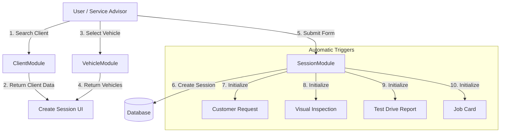

# Gixat UX Logic & Experience Report

## 1. Current User Experience Analysis
**Focus Area:** `Pages/Sessions/Create.cshtml` (New Vehicle Check-In)

Currently, the system uses a **traditional synchronous flow**:
1.  **Client Selection**: The page loads *all* clients into a standard HTML `<select>` dropdown.
    *   **UX Issue**: As the client base grows (e.g., >100 clients), this dropdown will become unmanageable and slow. Finding "John Smith" requires scrolling or relying on basic browser text matching.
2.  **Vehicle Selection**: Dependent on Client selection. Uses JavaScript to fetch vehicles after a client is picked.
    *   **UX Strength**: This is a good pattern (Cascading Dropdown). It prevents clutter.
    *   **UX Weakness**: If a client has many vehicles (e.g., a fleet owner), a simple dropdown might still be insufficient.
3.  **Validation**: Basic HTML5 validation. No specific format enforcement for phone numbers.

## 2. Proposed "Super User Friendly" Logic

To achieve a modern, app-like feel, we need to transition from "Static Forms" to "Dynamic Interactive Components".

### A. Autocomplete (Smart Search)
Instead of a long list, we will implement a **Type-Ahead Search**.

**Logic Flow:**
1.  User sees an input box: "Search Client (Name, Phone, or Email)..."
2.  User types "97150":
    *   System queries the API: `GET /api/clients/search?q=97150`
    *   Dropdown appears instantly with:
        *   *Ahmed Al-Mansoori (+971 50 123 4567)*
        *   *Sarah Jones (+971 50 987 6543)*
3.  User selects "Ahmed".
4.  **Auto-Fill**: The system automatically:
    *   Sets `SelectedClientId`.
    *   Loads Ahmed's vehicles into the next field.
    *   Shows a "Client Card" summary (VIP status, last visit) to confirm identity.

**Technical Requirement:**
- **Frontend**: Use a lightweight library like `Tom Select` or `Alpine.js` custom combobox.
- **Backend**: Ensure `ClientService` has a high-performance search endpoint (already partially exists in `GetByCompanyIdPagedAsync`).

### B. Mobile Validation & Country Codes
Phone numbers are critical for notifications (WhatsApp/SMS). We must ensure they are valid and standardized.

**Logic Flow:**
1.  **Country Selector**: A small flag dropdown (defaulting to UAE 🇦🇪 +971).
2.  **Phone Input**: User types the local number (e.g., `50 123 4567`).
3.  **Real-time Validation**:
    *   As the user types, JavaScript checks the length and prefix.
    *   If invalid (e.g., too short), the border turns red.
    *   If valid, a green checkmark appears.
4.  **Formatting**: On save, the system combines them into E.164 format: `+971501234567`.

**Technical Requirement:**
- **Library**: `intl-tel-input` (International Telephone Input) is the industry standard for this.
- **Backend**: Store numbers in E.164 format to ensure global compatibility.

## 3. Module Connections Diagram
This describes how the data flows when a user creates a Session.

## 4. Implementation To-Do List

### Phase 1: UI Components (The "Feel")
- [ ] **Install `Tom Select` or `Choices.js`**: For the Client Autocomplete dropdown.
- [ ] **Install `intl-tel-input`**: For the Phone Number input with country flags.
- [ ] **Create `_ClientSearch.cshtml` Partial**: A reusable component for searching clients anywhere in the app.

### Phase 2: Backend Support (The "Logic")
- [ ] **API Endpoint**: Create a dedicated JSON endpoint `GET /Clients/Search?term=...` that returns lightweight JSON (Id, Name, Phone) for the autocomplete.
- [ ] **Phone Normalization**: Update `ClientService.CreateAsync` to parse and format phone numbers before saving to DB.

### Phase 3: Integration (The "Flow")
- [ ] **Update `Pages/Sessions/Create.cshtml`**:
    - Replace `<select>` with the new Autocomplete component.
    - Add the "Client Summary" card that appears after selection.
- [ ] **Update `Pages/Clients/Index.cshtml`**:
    - Add the Country Code selector to the "Add Client" modal/page.

### Phase 4: Mobile Experience
- [ ] **Touch Targets**: Ensure the new dropdowns are large enough for thumb tapping on tablets/phones.
- [ ] **Keyboard Types**: Ensure the phone input triggers the numeric keypad on mobile devices (`type="tel"`).

---
*Generated by GitHub Copilot*
