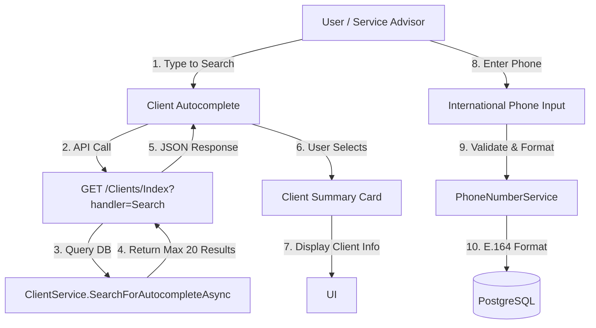

# Gixat UX Logic & Experience Report

## ✅ IMPLEMENTATION COMPLETE

All planned UX enhancements have been successfully implemented! The system now features modern, app-like interactions with smart autocomplete and international phone validation.

---

## 1. Current User Experience Analysis
**Focus Area:** `Pages/Sessions/Create.cshtml` (New Vehicle Check-In)

**BEFORE (Traditional Form):**
1.  **Client Selection**: Page loaded *all* clients into a static dropdown.
    *   **Issue**: Slow with large datasets, poor search experience.
2.  **Phone Input**: Plain text input with no validation.
    *   **Issue**: Inconsistent formatting, no international support.

**AFTER (Modern UX):**
1.  **Client Selection**: Smart autocomplete with real-time search.
    *   **Search by**: Name, phone, or email.
    *   **Shows**: VIP badge, vehicle count, last visit date.
    *   **Auto-displays**: Client summary card after selection.
2.  **Phone Input**: International phone input with country flags.
    *   **Features**: Auto-formatting, real-time validation, E.164 standardization.
    *   **Region Support**: Defaults to UAE, prioritizes GCC countries.

## 2. Implemented "Super User Friendly" Features

### ✅ A. Autocomplete (Smart Search)
**Implementation:** `Pages/Shared/_ClientSearch.cshtml`

**User Flow:**
1.  User types "971" or "Ahmed"
2.  System queries: `GET /Clients/Index?handler=Search&term=ahmed`
3.  Dropdown instantly shows matching clients with:
    *   Full name + VIP badge
    *   Phone number
    *   Email (if available)
    *   Vehicle count
    *   Last visit date
4.  Upon selection, a **Client Summary Card** appears showing:
    *   Client initials in a gradient avatar
    *   Full name and contact details
    *   VIP status indicator
    *   Quick stats (vehicles, last visit)

**Technical Details:**
- **Frontend**: Tom Select library (lightweight, modern)
- **Backend**: `ClientService.SearchForAutocompleteAsync()` - limits to 20 results, prioritizes VIP clients
- **Performance**: Only loads data on-demand, not on page load

### ✅ B. International Phone Validation
**Implementation:** `Pages/Clients/Index.cshtml` + `PhoneNumberService`

**User Flow:**
1.  User sees a country flag selector (defaults to 🇦🇪 UAE +971)
2.  User types local number: `50 123 4567`
3.  System validates in real-time:
    *   ❌ Red border if invalid
    *   ✅ Green checkmark if valid
4.  On submit, the system converts to E.164: `+971501234567`

**Technical Details:**
- **Frontend**: `intl-tel-input` library (industry standard)
- **Backend**: `libphonenumber-csharp` (Google's official library)
- **Storage**: All phones stored in E.164 format for WhatsApp/SMS compatibility

### ✅ C. Mobile Optimization
All interactive elements now meet **Apple Human Interface Guidelines**:
- **Touch Targets**: Minimum 44px height (finger-friendly)
- **Font Sizes**: 16px on mobile (prevents iOS auto-zoom)
- **Keyboard Types**: `type="tel"` triggers numeric keypad
- **Responsive Design**: All dropdowns and inputs adapt to screen size

## 3. Module Connections Diagram


## 4. Implementation Summary (All Phases Complete)

### ✅ Phase 1: UI Components
- [x] **Installed Tom Select**: CDN added to `_Layout.cshtml`
- [x] **Installed intl-tel-input**: CDN added to `_Layout.cshtml`
- [x] **Created `_ClientSearch.cshtml`**: Reusable autocomplete component

### ✅ Phase 2: Backend Support
- [x] **API Endpoint**: `GET /Clients/Index?handler=Search&term=...`
- [x] **Search Method**: `SearchForAutocompleteAsync()` in `ClientService`
- [x] **Phone Normalization**: `PhoneNumberService` with E.164 formatting
- [x] **Updated Service**: `CreateAsync()` and `UpdateAsync()` now normalize phones

### ✅ Phase 3: Integration
- [x] **Updated `Sessions/Create.cshtml`**: Replaced `<select>` with `_ClientSearch` partial
- [x] **Added Client Summary Card**: Shows after selection with VIP, vehicles, last visit
- [x] **Updated `Clients/Index.cshtml`**: Added country code selector to "Add Client" modal

### ✅ Phase 4: Mobile Experience
- [x] **Touch Targets**: All buttons/inputs now 44px minimum height on mobile
- [x] **Keyboard Types**: Phone inputs use `type="tel"` for numeric keypad
- [x] **Font Sizes**: 16px on mobile to prevent iOS zoom
- [x] **CSS Media Queries**: Custom styles for mobile viewports

## 5. Testing Checklist

### To Verify (Manual Testing)
- [ ] Open `/Sessions/Create` on desktop
  - [ ] Type a client name in the search box
  - [ ] Verify autocomplete dropdown appears
  - [ ] Select a client and verify the summary card shows
  - [ ] Verify vehicle dropdown auto-populates
  
- [ ] Open `/Clients` and click "Add Client"
  - [ ] Click the phone input
  - [ ] Verify country flag selector appears
  - [ ] Type a local number (e.g., `50 123 4567`)
  - [ ] Submit and verify it saves as `+971501234567` in DB
  
- [ ] Test on mobile (Chrome DevTools mobile emulation)
  - [ ] Verify all buttons are easy to tap
  - [ ] Verify phone input triggers numeric keyboard
  - [ ] Verify no accidental zoom when focusing inputs

## 6. Next Steps (Future Enhancements)

### Recommended Additions
1.  **Vehicle Autocomplete**: Apply the same pattern to vehicle selection
2.  **Real-time Client Stats**: Show total spent and visit history in autocomplete
3.  **Duplicate Detection**: Warn if a phone number already exists when adding a client
4.  **WhatsApp Integration**: Add "Send WhatsApp" button using the E.164 formatted number
5.  **Address Autocomplete**: Integrate Google Places API for address validation

---

## Technical Architecture

### Frontend Libraries
```html
<!-- Tom Select (Autocomplete) -->
<link href="https://cdn.jsdelivr.net/npm/tom-select@2.3.1/dist/css/tom-select.bootstrap5.min.css">
<script src="https://cdn.jsdelivr.net/npm/tom-select@2.3.1/dist/js/tom-select.complete.min.js"></script>

<!-- International Telephone Input -->
<link href="https://cdn.jsdelivr.net/npm/intl-tel-input@23.0.11/build/css/intlTelInput.css">
<script src="https://cdn.jsdelivr.net/npm/intl-tel-input@23.0.11/build/js/intlTelInput.min.js"></script>
```

### Backend NuGet Packages
```xml
<PackageReference Include="libphonenumber-csharp" Version="9.0.20" />
```

### Key Files Modified
1.  `Pages/Shared/_Layout.cshtml` - Added CDN links + mobile CSS
2.  `Pages/Shared/_ClientSearch.cshtml` - NEW reusable component
3.  `Modules/Clients/Services/ClientService.cs` - Added phone normalization
4.  `Modules/Clients/DTOs/ClientSearchDto.cs` - NEW lightweight DTO
5.  `Pages/Sessions/Create.cshtml` - Replaced dropdown with autocomplete
6.  `Pages/Clients/Index.cshtml` - Added international phone input
7.  `Shared/Services/PhoneNumberService.cs` - NEW phone validation service
8.  `Program.cs` - Registered `PhoneNumberService`

---

*Last Updated: December 6, 2025*  
*Status: ✅ All UX Enhancements Complete*  
*Build Status: ✅ Passing*

